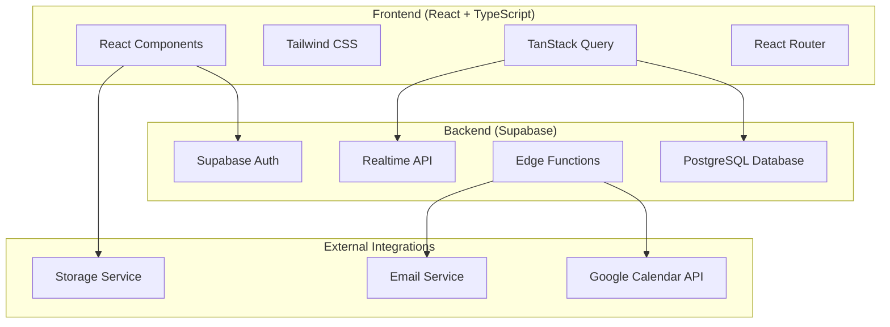

# Product Requirements Document (PRD)
## MerchantCare Scheduling Dashboard

---

**Document Version:** 1.0  
**Date:** January 25, 2025  
**Author:** Product Team  
**Status:** Draft  

---

## Table of Contents

1. [Executive Summary](#executive-summary)
2. [Product Overview](#product-overview)
3. [Business Requirements](#business-requirements)
4. [User Personas](#user-personas)
5. [Functional Requirements](#functional-requirements)
6. [Technical Requirements](#technical-requirements)
7. [User Experience Requirements](#user-experience-requirements)
8. [Integration Requirements](#integration-requirements)
9. [Security & Compliance](#security--compliance)
10. [Performance Requirements](#performance-requirements)
11. [Success Metrics](#success-metrics)
12. [Project Timeline](#project-timeline)
13. [Risk Assessment](#risk-assessment)
14. [Appendices](#appendices)

---

## Executive Summary

### Product Vision
MerchantCare Scheduling Dashboard is a comprehensive team-based appointment scheduling system designed to streamline customer support and sales interactions. The platform enables efficient management of customer calls, team availability, and booking workflows while providing robust administrative oversight and reporting capabilities.

### Key Objectives
- **Streamline Scheduling Process**: Reduce friction in booking customer support/sales calls
- **Optimize Team Utilization**: Ensure balanced workload distribution across team members
- **Enhance Customer Experience**: Provide seamless booking and management experience
- **Improve Operational Efficiency**: Automate scheduling workflows and reduce manual coordination
- **Enable Data-Driven Decisions**: Provide comprehensive analytics and reporting

### Target Market
- Customer support teams
- Sales organizations
- Professional services firms
- Any business requiring structured client interaction scheduling

---

## Product Overview

### Current State
The MerchantCare Scheduling Dashboard addresses the common challenge of coordinating customer interactions across multiple team members while maintaining service quality and operational efficiency.

### Product Description
A web-based scheduling platform that provides:
- **Team-centric booking system** with individual member availability management
- **Administrative dashboard** for oversight and reporting
- **Customer-facing booking interface** for easy appointment scheduling
- **Integration capabilities** with Google Calendar and other business tools
- **Comprehensive booking lifecycle management** from creation to completion

### Core Value Propositions
1. **For Administrators**: Complete visibility and control over team scheduling and performance
2. **For Team Members**: Simplified availability management and booking oversight
3. **For Customers**: Easy, self-service booking with real-time availability
4. **For Organizations**: Improved resource utilization and customer satisfaction metrics

---

## Business Requirements

### Primary Business Goals
1. **Increase Team Productivity** by 25% through automated scheduling
2. **Reduce Booking Conflicts** by 90% through real-time availability management
3. **Improve Customer Satisfaction** by providing flexible booking options
4. **Enhance Reporting Capabilities** for data-driven decision making
5. **Scale Operations** to support growing team sizes and booking volumes

### Key Performance Indicators (KPIs)
- Booking completion rate: >95%
- Average booking time: <3 minutes
- Team utilization rate: 80-90%
- Customer satisfaction score: >4.5/5
- System uptime: >99.5%

### Revenue Impact
- **Direct**: Improved team efficiency leading to increased customer handling capacity
- **Indirect**: Enhanced customer experience driving retention and referrals
- **Cost Savings**: Reduced administrative overhead and scheduling conflicts

---

## User Personas

### 1. System Administrator (Primary User)
**Profile**: Sarah, Operations Manager
- **Role**: Oversees team scheduling and performance
- **Goals**: 
  - Monitor team productivity and booking metrics
  - Generate reports for management
  - Manage team member profiles and availability
  - Resolve scheduling conflicts
- **Pain Points**: 
  - Manual scheduling coordination
  - Lack of real-time visibility
  - Difficulty in resource planning
- **Tech Savviness**: High

### 2. Team Member (Primary User)
**Profile**: Mike, Customer Success Representative
- **Role**: Handles customer support calls and manages personal schedule
- **Goals**:
  - Manage personal availability and blocked time
  - View upcoming bookings and customer details
  - Integrate with personal calendar systems
  - Minimize scheduling disruptions
- **Pain Points**:
  - Double bookings
  - Last-minute schedule changes
  - Disconnected calendar systems
- **Tech Savviness**: Medium to High

### 3. Customer/Client (Primary User)
**Profile**: Jennifer, E-commerce Business Owner
- **Role**: Seeks support or sales consultation
- **Goals**:
  - Quickly book available time slots
  - Reschedule or cancel if needed
  - Receive confirmations and reminders
  - Minimal friction in booking process
- **Pain Points**:
  - Limited availability visibility
  - Complex booking processes
  - Poor communication about changes
- **Tech Savviness**: Medium

### 4. Business Stakeholder (Secondary User)
**Profile**: David, VP of Customer Success
- **Role**: Oversees customer success organization
- **Goals**:
  - Access to performance metrics and trends
  - Resource planning and capacity management
  - ROI analysis of customer interactions
- **Pain Points**:
  - Lack of actionable insights
  - Difficulty in resource allocation
- **Tech Savviness**: Medium

---

## Functional Requirements

### 1. User Management & Authentication

#### 1.1 Authentication System
- **REQ-1.1.1**: Users must authenticate via secure login (email/password)
- **REQ-1.1.2**: Support for role-based access control (Admin, Team Member)
- **REQ-1.1.3**: Password reset functionality via email
- **REQ-1.1.4**: Session management with automatic timeout

#### 1.2 User Profile Management
- **REQ-1.2.1**: Team members can manage personal profiles (name, email, avatar)
- **REQ-1.2.2**: Administrators can create, edit, and deactivate team member accounts
- **REQ-1.2.3**: Role assignment and permission management

### 2. Scheduling & Availability Management

#### 2.1 Availability Settings
- **REQ-2.1.1**: Team members can set working hours (daily/weekly patterns)
- **REQ-2.1.2**: Support for blocked time/vacation scheduling
- **REQ-2.1.3**: Recurring availability patterns
- **REQ-2.1.4**: Exception handling for holidays and special dates

#### 2.2 Time Slot Management
- **REQ-2.2.1**: Configurable time slot durations (15, 30, 60 minutes)
- **REQ-2.2.2**: Buffer time between appointments
- **REQ-2.2.3**: Real-time availability updates
- **REQ-2.2.4**: Batch time slot creation and management

#### 2.3 Booking Creation & Management
- **REQ-2.3.1**: Customer-facing booking interface with available time slots
- **REQ-2.3.2**: Required fields: Brand Name, Ticket ID, Description
- **REQ-2.3.3**: Optional additional guest email addresses
- **REQ-2.3.4**: Booking confirmation with unique booking ID
- **REQ-2.3.5**: Email notifications for booking confirmations

### 3. Booking Lifecycle Management

#### 3.1 Booking States
- **REQ-3.1.1**: Support for booking states: Scheduled, Rescheduled, Cancelled, Completed
- **REQ-3.1.2**: State transition workflows with appropriate notifications
- **REQ-3.1.3**: Booking history and audit trail

#### 3.2 Modification Capabilities
- **REQ-3.2.1**: Customers can reschedule bookings within defined windows
- **REQ-3.2.2**: Cancellation functionality with configurable notice periods
- **REQ-3.2.3**: Administrative override capabilities for all booking modifications
- **REQ-3.2.4**: Automated notifications for all changes

### 4. Administrative Dashboard

#### 4.1 Dashboard Overview
- **REQ-4.1.1**: Real-time metrics display: Upcoming, Completed, Cancelled, Rescheduled bookings
- **REQ-4.1.2**: Team workload visualization and distribution
- **REQ-4.1.3**: Calendar view with filtering capabilities
- **REQ-4.1.4**: Quick action buttons for common tasks

#### 4.2 Team Management
- **REQ-4.2.1**: Team member list with status indicators
- **REQ-4.2.2**: Individual team member booking views
- **REQ-4.2.3**: Team member schedule management
- **REQ-4.2.4**: Performance metrics per team member

#### 4.3 Booking Management
- **REQ-4.3.1**: Comprehensive booking list with filtering and search
- **REQ-4.3.2**: Bulk operations for booking management
- **REQ-4.3.3**: Detailed booking views with customer information
- **REQ-4.3.4**: Booking modification and cancellation capabilities

### 5. Reporting & Analytics

#### 5.1 Standard Reports
- **REQ-5.1.1**: Weekly booking reports with team breakdown
- **REQ-5.1.2**: Team utilization reports
- **REQ-5.1.3**: Customer satisfaction tracking
- **REQ-5.1.4**: Booking trend analysis

#### 5.2 Export Capabilities
- **REQ-5.2.1**: Export reports to Excel/CSV format
- **REQ-5.2.2**: Scheduled report generation and email delivery
- **REQ-5.2.3**: Custom date range reporting

### 6. Calendar Integration

#### 6.1 Google Calendar Integration
- **REQ-6.1.1**: OAuth integration with Google Calendar
- **REQ-6.1.2**: Bidirectional sync of bookings and availability
- **REQ-6.1.3**: Automatic event creation for confirmed bookings
- **REQ-6.1.4**: Conflict detection and resolution

#### 6.2 Calendar Features
- **REQ-6.2.1**: Multiple calendar support per team member
- **REQ-6.2.2**: Calendar sharing and visibility controls
- **REQ-6.2.3**: Meeting link generation and attachment

---

## Technical Requirements

### 1. Technology Stack

#### 1.1 Frontend
- **Framework**: React 18+ with TypeScript
- **Styling**: Tailwind CSS with custom design system
- **Component Library**: shadcn/ui components
- **State Management**: React Context API + TanStack Query
- **Routing**: React Router DOM
- **Build Tool**: Vite

#### 1.2 Backend & Database
- **Backend Service**: Supabase (PostgreSQL + Edge Functions)
- **Authentication**: Supabase Auth
- **Real-time**: Supabase Realtime
- **File Storage**: Supabase Storage (for avatars/attachments)

#### 1.3 External Integrations
- **Calendar**: Google Calendar API v3
- **Email**: Supabase Edge Functions with email service
- **Notifications**: In-app notifications + email

### 2. Architecture Requirements

#### 2.1 System Architecture
- **Pattern**: Single Page Application (SPA) with RESTful API
- **Database**: Relational database with proper normalization
- **Caching**: Query-level caching with TanStack Query
- **Real-time Updates**: WebSocket connections for live data

#### 2.2 Data Models

##### Team Members Table
```sql
- id (UUID, Primary Key)
- name (TEXT)
- email (TEXT, Unique)
- role (ENUM: admin, member)  
- avatar_url (TEXT)
- calendar_connected (BOOLEAN)
- google_calendar_id (TEXT)
- created_at (TIMESTAMP)
- updated_at (TIMESTAMP)
```

##### Time Slots Table
```sql
- id (UUID, Primary Key)
- member_id (UUID, Foreign Key)
- date (DATE)
- start_time (TIME)
- end_time (TIME)
- available (BOOLEAN)
- created_at (TIMESTAMP)
```

##### Bookings Table
```sql
- id (UUID, Primary Key)
- member_id (UUID, Foreign Key)
- time_slot_id (UUID, Foreign Key)
- brand_name (TEXT)
- ticket_id (TEXT)
- description (TEXT)
- additional_guests (TEXT[])
- status (ENUM: scheduled, rescheduled, cancelled, completed)
- google_event_id (TEXT)
- created_at (TIMESTAMP)
- updated_at (TIMESTAMP)
```

### 3. Security Requirements

#### 3.1 Authentication & Authorization
- **REQ-SEC-1**: Multi-factor authentication support
- **REQ-SEC-2**: Role-based access control with principle of least privilege
- **REQ-SEC-3**: Secure session management with JWT tokens
- **REQ-SEC-4**: Password policy enforcement

#### 3.2 Data Protection
- **REQ-SEC-5**: Data encryption at rest and in transit (TLS 1.3)
- **REQ-SEC-6**: PII data handling compliance (GDPR/CCPA)
- **REQ-SEC-7**: Audit logging for all data modifications
- **REQ-SEC-8**: Regular security vulnerability assessments

---

## User Experience Requirements

### 1. Design Principles

#### 1.1 Usability
- **Intuitive Navigation**: Clear, consistent navigation patterns
- **Responsive Design**: Mobile-first approach with progressive enhancement
- **Accessibility**: WCAG 2.1 AA compliance
- **Performance**: Sub-3 second page load times

#### 1.2 Visual Design
- **Design System**: Consistent color palette, typography, and spacing
- **Brand Alignment**: Professional appearance suitable for business use
- **Dark/Light Mode**: Support for user preference themes
- **Interactive Feedback**: Clear visual feedback for all user actions

### 2. User Flows

#### 2.1 Customer Booking Flow
1. **Landing Page**: View available team members and general availability
2. **Calendar Selection**: Choose preferred date and view available time slots
3. **Booking Form**: Enter required information (Brand Name, Ticket ID, Description)
4. **Confirmation**: Review booking details and confirm
5. **Success Page**: Display booking confirmation with unique ID

#### 2.2 Team Member Daily Workflow
1. **Dashboard Login**: View daily schedule and upcoming bookings
2. **Availability Management**: Update working hours or add blocked time
3. **Booking Details**: Review customer information before meetings
4. **Post-Meeting**: Mark bookings as completed or reschedule if needed

#### 2.3 Administrator Management Flow
1. **Admin Dashboard**: Overview of team performance and metrics
2. **Team Management**: Add/edit team member profiles and permissions
3. **Booking Oversight**: Monitor all bookings and resolve conflicts
4. **Reporting**: Generate and export performance reports

---

## Integration Requirements

### 1. Google Calendar Integration

#### 1.1 Core Functionality
- **OAuth 2.0 Authentication**: Secure authorization flow for calendar access
- **Event Synchronization**: Two-way sync between platform and Google Calendar
- **Conflict Detection**: Automatic detection and prevention of double bookings
- **Event Management**: Create, update, and delete events programmatically

#### 1.2 Data Synchronization
- **Real-time Updates**: Immediate reflection of calendar changes
- **Batch Processing**: Handle bulk calendar operations efficiently
- **Error Handling**: Graceful handling of API rate limits and failures
- **Data Consistency**: Maintain data integrity across systems

### 2. Email Integration

#### 2.1 Notification System
- **Booking Confirmations**: Automated emails for new bookings
- **Reminders**: Scheduled reminders before meetings
- **Change Notifications**: Updates for reschedules or cancellations
- **Report Delivery**: Automated report distribution

#### 2.2 Email Templates
- **Professional Design**: Branded email templates
- **Personalization**: Dynamic content based on booking details
- **Multi-language Support**: Localized email content
- **Tracking**: Email delivery and engagement tracking

### 3. Future Integration Considerations

#### 3.1 CRM Integration
- **Customer Data Sync**: Integration with popular CRM systems
- **Lead Tracking**: Automatic lead creation from booking data
- **Activity Logging**: Record customer interactions in CRM

#### 3.2 Video Conferencing
- **Meeting Link Generation**: Automatic creation of video meeting links
- **Platform Support**: Zoom, Microsoft Teams, Google Meet integration
- **Recording Management**: Handle meeting recordings and transcripts

---

## Performance Requirements

### 1. System Performance

#### 1.1 Response Times
- **Page Load Time**: <3 seconds for initial page load
- **API Response Time**: <500ms for standard operations
- **Calendar View Rendering**: <2 seconds for monthly view
- **Search Operations**: <1 second for booking searches

#### 1.2 Throughput
- **Concurrent Users**: Support 500+ concurrent users
- **Booking Volume**: Handle 10,000+ bookings per month
- **API Rate Limits**: 1000 requests per minute per user
- **Database Operations**: 1000+ transactions per minute

### 2. Scalability Requirements

#### 2.1 Horizontal Scaling
- **Auto-scaling**: Automatic resource scaling based on demand
- **Load Distribution**: Efficient load balancing across instances
- **Database Scaling**: Read replicas for improved performance
- **CDN Integration**: Global content delivery for static assets

#### 2.2 Capacity Planning
- **User Growth**: Support 10x user growth within 12 months
- **Data Growth**: Handle exponential growth in booking data
- **Feature Expansion**: Architecture supports additional features
- **Geographic Expansion**: Multi-region deployment capability

---

## Success Metrics

### 1. User Adoption Metrics

#### 1.1 Engagement Metrics
- **Daily Active Users**: Track user engagement patterns
- **Feature Adoption Rate**: Measure utilization of key features
- **User Retention**: Monthly and quarterly retention rates
- **Session Duration**: Average time spent in application

#### 1.2 Business Impact Metrics
- **Booking Completion Rate**: Percentage of successful bookings
- **Team Utilization**: Efficiency of team member schedules
- **Customer Satisfaction**: Feedback scores and ratings
- **Revenue Impact**: Correlation with business revenue metrics

### 2. Technical Performance Metrics

#### 2.1 System Health
- **Uptime**: System availability percentage
- **Error Rates**: Application and API error frequencies
- **Performance**: Response time distributions
- **Security**: Security incident tracking and resolution

#### 2.2 Quality Metrics
- **Bug Discovery Rate**: Defects found in production
- **Customer Support Tickets**: Volume and resolution time
- **Feature Delivery**: Sprint velocity and feature completion
- **Code Quality**: Technical debt and maintainability scores

---

## Project Timeline

### Phase 1: Foundation (Weeks 1-4)
- ✅ **Completed**: Core authentication and user management
- ✅ **Completed**: Basic team member and booking models
- ✅ **Completed**: Initial UI components and design system
- ✅ **Completed**: Supabase integration setup

### Phase 2: Core Scheduling (Weeks 5-8)
- ✅ **Completed**: Availability management system
- ✅ **Completed**: Time slot creation and management
- ✅ **Completed**: Customer booking interface
- ✅ **Completed**: Basic administrative dashboard

### Phase 3: Advanced Features (Weeks 9-12)
- ✅ **Completed**: Google Calendar integration
- ✅ **Completed**: Booking lifecycle management
- ✅ **Completed**: Email notification system
- ✅ **Completed**: Enhanced admin features

### Phase 4: Polish & Optimization (Weeks 13-16)
- **In Progress**: Performance optimization
- **Planned**: Advanced reporting features
- **Planned**: Mobile responsiveness improvements
- **Planned**: Security hardening

### Phase 5: Future Enhancements (Weeks 17+)
- **Planned**: Additional integrations (CRM, video conferencing)
- **Planned**: Advanced analytics and insights
- **Planned**: Multi-language support
- **Planned**: API for third-party integrations

---

## Risk Assessment

### 1. Technical Risks

#### 1.1 High Risk
- **Google Calendar API Changes**: Dependency on external API stability
  - **Mitigation**: Implement robust error handling and fallback mechanisms
- **Database Performance**: Scaling challenges with large datasets
  - **Mitigation**: Implement query optimization and database indexing strategies

#### 1.2 Medium Risk
- **Browser Compatibility**: Cross-browser functionality issues
  - **Mitigation**: Comprehensive testing across major browsers
- **Third-party Integration Reliability**: External service dependencies
  - **Mitigation**: Implement circuit breaker patterns and graceful degradation

### 2. Business Risks

#### 2.1 High Risk
- **User Adoption**: Lower than expected user engagement
  - **Mitigation**: User feedback loops and iterative improvements
- **Competition**: Market saturation with similar solutions
  - **Mitigation**: Focus on unique value propositions and customer experience

#### 2.2 Medium Risk
- **Feature Scope Creep**: Uncontrolled expansion of requirements
  - **Mitigation**: Strict change control process and stakeholder alignment
- **Resource Constraints**: Limited development resources
  - **Mitigation**: Prioritization framework and phased delivery approach

### 3. Security Risks

#### 3.1 High Risk
- **Data Breach**: Unauthorized access to customer data
  - **Mitigation**: Comprehensive security controls and regular audits
- **Authentication Vulnerabilities**: Weak authentication mechanisms
  - **Mitigation**: Multi-factor authentication and security best practices

---

## Appendices

### Appendix A: Technical Architecture Diagram



### Appendix B: Database Schema

#### Entity Relationship Diagram
- **Teams** (1:N) **Team Members**
- **Team Members** (1:N) **Time Slots**
- **Team Members** (1:N) **Bookings**
- **Time Slots** (1:1) **Bookings**
- **Bookings** (1:N) **Booking History**

### Appendix C: API Endpoints

#### Authentication
- `POST /auth/login` - User authentication
- `POST /auth/logout` - User logout
- `POST /auth/refresh` - Token refresh

#### Team Management
- `GET /api/team-members` - List team members
- `POST /api/team-members` - Create team member
- `PUT /api/team-members/{id}` - Update team member
- `DELETE /api/team-members/{id}` - Delete team member

#### Booking Management
- `GET /api/bookings` - List bookings
- `POST /api/bookings` - Create booking
- `PUT /api/bookings/{id}` - Update booking
- `DELETE /api/bookings/{id}` - Cancel booking

#### Availability Management
- `GET /api/time-slots` - List available time slots
- `POST /api/time-slots` - Create time slots
- `PUT /api/time-slots/{id}` - Update time slot
- `DELETE /api/time-slots/{id}` - Delete time slot

### Appendix D: User Interface Mockups

*[Detailed UI mockups would be included here in the actual document]*

### Appendix E: Test Cases

#### Critical User Journeys
1. **Customer Booking Flow**
   - Navigate to booking page
   - Select team member and time slot
   - Complete booking form
   - Receive confirmation

2. **Team Member Availability Management**
   - Login to dashboard
   - Navigate to availability settings
   - Set working hours and blocked time
   - Save changes and verify updates

3. **Administrator Team Management**
   - Access admin dashboard
   - Add new team member
   - Configure permissions and settings
   - Monitor team performance metrics

---

**Document End**

*This PRD serves as the comprehensive specification for the MerchantCare Scheduling Dashboard. It should be reviewed and updated regularly as the product evolves and new requirements emerge.*